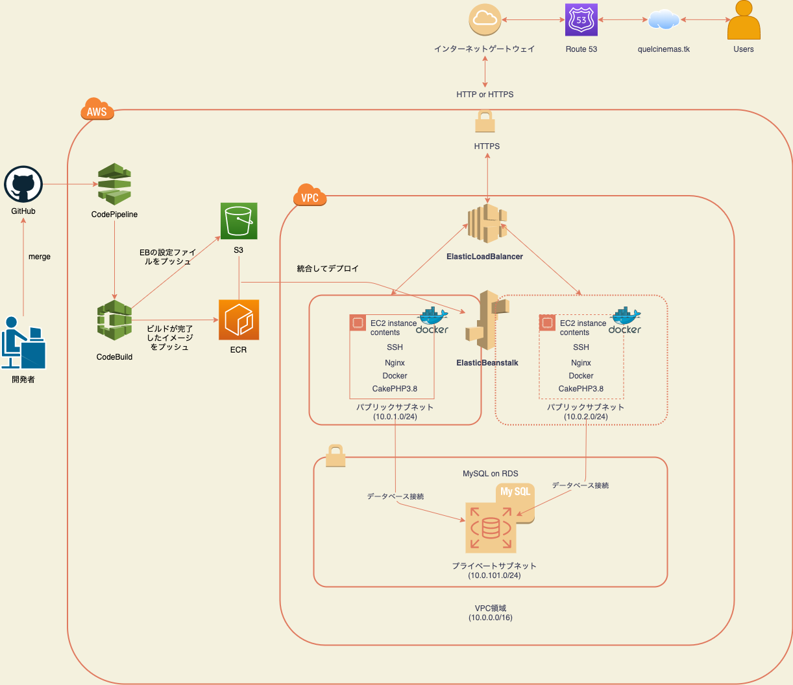

## QUELCINEMAS

### ABOUT
   オンライン映画予約サービスのデモサイトです。
   会員登録→上映映画選択→支払い情報登録（クレジットカード）→映画予約まで一連の操作が可能となっております。

### 使用技術
- HTML /CSS
- Javascript / jQuery / Ajax
- PHP7.3
- CakePHP3.8
- AWS(EC2,VPC,RDS,S3,ELB,ECR,ElasticBeanstalk,Route53,AamazonCertificateManager,CodePipeline)
- Docker
- Docker-compose(ローカル開発環境用)
- Nginx
- MySQL8.0
- Git/GitHub

## 🌐 App URL

### https://quelcinemas.tk

## ⛏HOW TO USE
#### ログイン→座席予約を行う場合
1.ヘッダーの「ログイン」でログインページに遷移し、下記のサンプルユーザー情報を入力します。
| メールアドレス | パスワード |
| ------------- | ------------- |
| hoge@example.com  | hogehoge  |

2.ヘッダーの「上映スケジュール」ページから予約したい映画を選択します（この時、予約済みの映画を選択するとリダイレクトされます。マイページよりキャンセルを行なってからの再度予約が必要です）

3.座席選択→支払い情報入力→確認画面の流れで予約が完了します。確認したい場合は「マイページ」を参照してください。

※サンプルユーザーは支払い情報を登録済みです。もし新規に登録を行う場合は個人の番号ではなく、下記のテストカード番号をお使いください。

テストカード番号（参照：https://www.omise.co/ja/api-testing/japan）

正常系
| カード番号 | カードブランド |
| ------------- | ------------- |
| 4242 4242 4242 4242  | Visa  |
| 4111 1111 1111 1111  | Visa  |
| 5555 5555 5555 4444  | Mastercard  |
| 5454 5454 5454 5454  | Mastercard  |

異常系 (バリデーションが発生します)
| カード番号 | カードブランド |
| ------------- | ------------- |
| 4111 1111 1114 0011  | Visa  |
| 5555 5511 1111 0011  | Mastercard  |

#### ログインを行わない場合
- 映画スケジュール
- 料金表
- トップページ

はログインせずとも閲覧可能となっております。

## 🛠feature
- 仮予約機能：座席を予約し、かつ決済情報が未入力の状態が15分経過した場合は、その予約は削除される機能を実装しております。
- 座席選択後のキャンセル機能：座席選択後の確認画面で「キャンセル」ボタンを押した場合は、仮予約はされずに座席選択画面で先ほど選択した座席を選択済み状態遷移するよう実装しています。
- 可用性を実現するために負荷が増えた際にはEC2インスタンスが自動的に増設されるように実装しております。(AutoScalling）
- 自動ビルド、デプロイ機能を実装しました。GitHubの特定のブランチにマージすることでAWSのECRへのイメージの自動ビルドをCodeBuildが行い、CodePipelineによりElasticBeanstalkにデプロイを行います。

## 🌐Network

## Other
本開発は3人でのチーム開発で行いました。

DBの概念設計から物理設計や、手動テストの項目を考え（境界値分析、同値分割など）、実施するまでアプリ開発の一通りの工程を行いました。
また、チーム開発ではレビューの精度を高めるために話し合いを行なっておりました。
いくつかプルリクエストを提出したものと、メンバーから提出されたものをレビューしたリンクを抜粋いたしました。
開発の流れをご覧いただければと思います。
- 提出プルリクエスト

https://github.com/labotinc/quelcode-team4-2/pull/25

https://github.com/labotinc/quelcode-team4-2/pull/36
- レビュープルリクエスト

https://github.com/labotinc/quelcode-team4-2/pull/46

https://github.com/labotinc/quelcode-team4-2/pull/52
